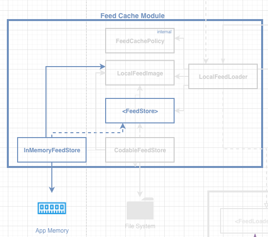
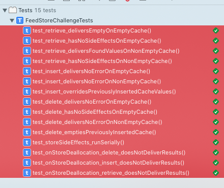
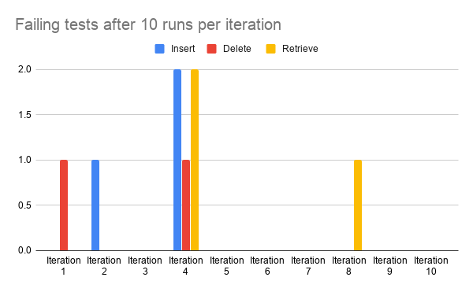
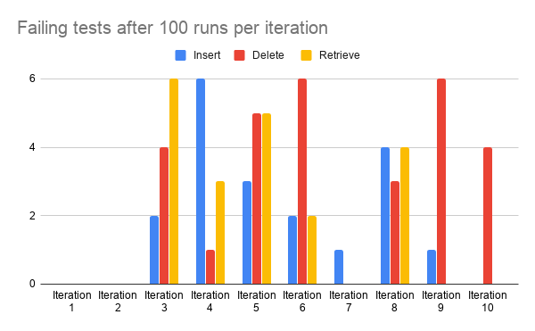
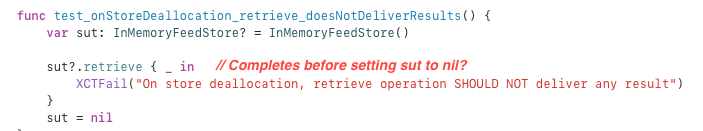
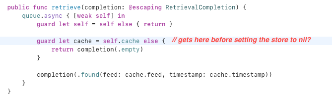

# The `FeedStore` challenge - iOSLeadEssentials.com


You are called to build your own persistence infrastructure implementation by creating a new component that conforms to the `<FeedStore>` protocol.

Your custom persistence infrastructure implementation can be backed by any persistence stack you wish, i.e. CoreData, Realm, in memory, etc, as shown in the diagram below.


We advise you to invest some time and effort to produce a clean and well-presented solution to demonstrate your knowledge as it can be **an ideal addition to your project portfolio**!

## Instructions

1. Fork the latest version of [the challenge repo](https://github.com/essentialdevelopercom/ios-lead-essentials-feed-store-challenge).
2. Implement **at least one** `<FeedStore>` implementation of your choice.
3. Use the `Tests/FeedStoreChallengeTests.swift` to validate your implementation. We recommend you to implement one test at a time. Follow the process: Make the test pass, commit, and move to the next one. In the end, all tests **must pass**.
4. If your implementation has failable operations (e.g., it might fail to load data from disk), uncomment and implement the failable test extensions at the bottom of the `Tests/FeedStoreChallengeTests.swift` test file.
5. When you’re done implementing your `<FeedStore>` solution, create a Pull Request from your branch to the [main challenge repo](https://github.com/essentialdevelopercom/ios-lead-essentials-feed-store-challenge). Use the name of your implementation as the title for the Pull Request, for example, *“CoreData implementation”*.
6. Extra (optional): If your implementation persists the data across app launches (e.g., CoreData/Realm), you should add Integration Tests to check this behavior. In the lectures, we tested this behavior with Integration Tests in another target, but for this challenge, you can do it in the same test target.

## Guidelines

1. Aim to commit your changes every time you add/alter the behavior of your system or refactor your code.
2. The system should always be in a green state, meaning that in each commit all tests should be passing.
3. The project should build without warnings.
4. The code should be carefully organized and easy to read (e.g. indentation must be consistent, etc.).
5. Aim to create short methods respecting the Single Responsibility Principle.
6. Aim to declare dependencies explicitly, instead of implicitly, leveraging dependency injection wherever necessary.
7. Aim **not** to block the main thread. Strive to run operations in a background queue.
8. Aim for descriptive commit messages that clarify the intent of your contribution which will help other developers understand your train of thought and purpose of changes.
9. Make careful and proper use of access control, marking as `private` any implementation details that aren’t referenced from other external components.
10. Aim to write self-documenting code by providing context and detail when naming your components, avoiding explanations in comments.

Finally, add to this README file:

### The Dependency Diagram demonstrating the architecture of your solution.

`InMemoryFeedStore` as a concrete implementation of  `<FeedStore>`

It uses as `cache` a private optional property

```
private var cache: (feed: [LocalFeedImage], timestamp: Date)?
```

* Cache `inserting` is nothing else than replacing the current property value
* Cache `deleting` is nothing else than setting the property to nil
* Cache `retrieving` is nothing else than completing with `.found` with the values stored in the property, or  `.empty` if the property is `nil`



#### Threading

`InMemoryFeedStore` operations run in  a private background queue. Clients are responsible to dispatch to appropriate threads, if needed.

Side effects operations, `insertion` and `deletion`, run serially as they are `barrier` operations. `retrieval` runs concurrently.

#### Failable Cases

No **failable** cases required as there is no failure cases for this implementation.

#### Unit Tests

All unit tests included as part of the callenge are implemented and are passing.
Additional tests are included to validate that at `InMemoryFeedStore` deallocation, the operations do not deliver any response. Please see the *Comments and remarks you think other developers will find useful.* section for something I noticed about this tests when running them in batch.



### Comments and remarks you think other developers will find useful.

### Failing tests when running them repeatedly

**Context**

After adding a private queueu to the `InMemoryFeedCache` to allow operations to run in a background, the corresponding tests were added to validate that no response is deliverd after store deallocation:

```
test_onStoreDeallocation_delete_doesNotDeliverResults
test_onStoreDeallocation_insert_doesNotDeliverResults
test_onStoreDeallocation_retrieve_doesNotDeliverResults
```

While running the test suite consecutively to validate tests stability, the mentioned tests failed randomly. In order to understand what could be causing the problem, I did gather the info shown in the attached images. They show how the test suite, and in particular the `doesNotDeliverResults`  tests,  behaves when running the tests consecutively : 10 and 100 times in 10 iterations, so 1st iteration run it 10 or 100 times, 2nd iteration the same and so on.

As you can see, some tests failures are reported. The failures are not consistent and do not show any apparent pattern. All of the `doesNotDeliverResults` tests failed at some point.
It didn't happen to me while I was  in the TDD flow of implementation, but i guess it was because I was not running them 10 times or so each time.





Looking at the code and the tests, the only explanation that I have is that sometimes the completion handler finishes before setting the `sut` to `nil`, causing the failing tests.





**Important points**

* It didn't happen to me while I was TDDing the solution. I did notice this after completing the implementation and performing a step I always do additional to the implementation, running the tests repeatedly.
* All of the `doesNotDeliverResults` tests failed at some point.

**Open Questions**

* If my theory is correct, completion happening before the deallocation, I don't know what can be done to prevent that on production 🤯.
* If my theory is correct, Should I remove the tests to avoid the CI pipeline to fail?
* If my theory is not correct, any pointer would be appreciated. Things I tried
    * Run the tests in parallel or serial - Same result.
    * Using a pure serial queue instead of a concurrent one with barriers - same result
